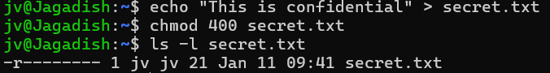
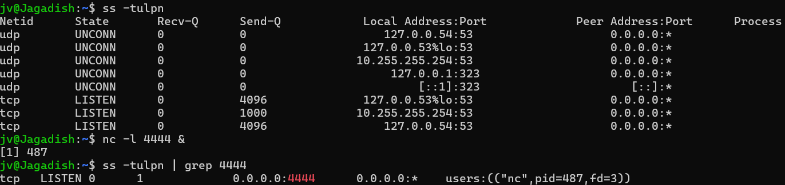
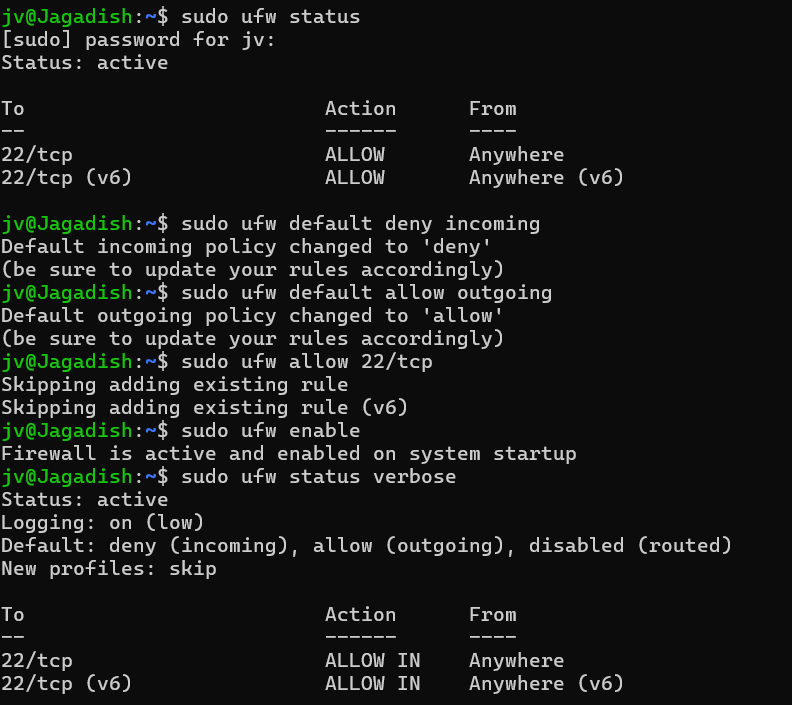
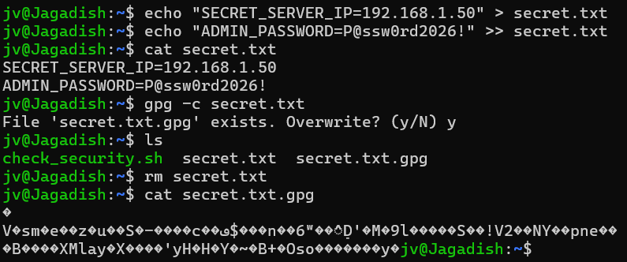

# Cloud Security Mastery Lab Logs

## Lab 1: Linux Process Auditing & Threat Hunting
**Objective:** Identify, investigate, and terminate a malicious background process to ensure system integrity.

### Steps Taken:
1. **Detection:** Used `ps aux` to list all running processes.
2. **Filtering:** Used `grep` to isolate a suspicious `sleep` process acting as a placeholder for a malicious task.
3. **Neutralization:** Executed `kill -9 [PID]` to force-terminate the process immediately.

### Evidence  
! [Detection Phase](detection.png)
! [Neutralization Phase](neutralization.png) 

### Tools Used:
* `ps aux` - Process status (all users)
* `grep` - Pattern matching
* `kill` - Process termination signal

---

## Lab 2: Hardening File Permissions (Least Privilege)
**Objective:** Secure a sensitive file by restricting permissions to "Read-Only" for the owner, preventing unauthorized access or modification.

### Steps Taken:
1. **Creation:** Created a sensitive file `secret.txt` containing confidential data.
2. **Lockdown:** Used `chmod 400` to remove all access from "Group" and "Others," and remove "Write/Execute" access from the owner.
3. **Verification:** Used `ls -l` to audit the file and confirm the hardened permission string: `-r--------`.

### Tools Used:
* `echo` - To create the file and data.
* `chmod 400` - To set absolute permissions (Owner: Read only).
* `ls -l` - To view the file’s security metadata.

### Evidence:

---

## Lab 3: Network Auditing & Socket Security
**Objective:** Identify active network listeners and analyze the system's "Attack Surface" by auditing open ports.

### Steps Taken:
1. **Network Scan:** Used the `ss -tulpn` command to list all active TCP and UDP listening sockets.
2. **Threat Simulation:** Opened a temporary listener on port `4444` using `nc -l 4444`.
3. **Audit & Cleanup:** Verified the open port in the process list and terminated the listener to return to a secure state.

### Tools Used:
* `ss` - Socket Statistics tool (modern replacement for `netstat`).
* `nc` (Netcat) - Used for reading/writing data across network connections.
* `grep` - To filter specific port numbers from the results.

### Evidence:

---

## Lab 4: Security Log Auditing & Incident Investigation
**Objective:** Perform a deep-dive audit of system logs to identify user activity, administrative escalations, and potential backdoors.

### Steps Taken:
1. **Accessing Logs:** Audited the `/var/log/auth.log` file using `sudo` privileges.
2. **Session Auditing:** Tracked "session opened" events to monitor user login/logout patterns.
3. **Account Monitoring:** Searched for "new user" entries to ensure no unauthorized backdoor accounts were created.
4. **Command Logging:** Extracted a history of executed `sudo` commands to verify administrative accountability.

### Tools Used:
* `grep -a` - To force-read logs as text and filter for specific security keywords.
* `tail` - To focus the investigation on the most recent system events.
* `auth.log` - The central repository for all Linux authentication data.

### Evidence:
.png)
.png)
.png)

---

## Lab 5: Network Hardening with UFW Firewall
**Objective:** Secure the system by implementing a "Deny-by-Default" firewall policy to minimize the network attack surface.

### Steps Taken:
1. **Policy Configuration:** Set default rules to `deny incoming` and `allow outgoing` to prevent unauthorized external access.
2. **Service Protection:** Explicitly allowed traffic only on Port 22 (SSH) to maintain secure administrative access.
3. **Activation:** Enabled the Uncomplicated Firewall (UFW) and verified the active rule set.

### Tools Used:
* `UFW` (Uncomplicated Firewall) - A user-friendly interface for managing iptables.
* `ufw status verbose` - Used to audit the active security posture and logging status.

### Evidence:

---

## Lab 6: SSH Hardening & Environment Troubleshooting
**Objective:** Secure the OpenSSH server by disabling Root login and resolving service-level errors.

### Steps Taken:
1. **Rule Modification (Nano):** Accessed `/etc/ssh/sshd_config` to set `PermitRootLogin no`. This is a critical hardening step to prevent brute-force attacks on the root account.
2. **Configuration Audit:** Executed `sudo sshd -t` to perform a syntax check.
3. **Service Management:** Successfully restarted the SSH daemon using `systemctl`.
4. **Resiliency:** Identified a command typo and manually corrected it to finalize the service update.

### Tools Used:
* **GNU Nano:** Used for precision editing of system configuration files.
* **SSHD Daemon:** The background service managing secure remote connections.
* **Systemctl:** The interface for controlling system services and verifying uptime.

### Evidence:
1. **Config View:** .png)
2. **Activation View:** .png)
---

## Lab 7: Security Automation (Bash Scripting)
**Objective:** Create a custom automated tool to audit system security posture in a single command.

### Steps Taken:
1. **Script Development (Nano):** Created a Bash script to pull data from UFW (Firewall), SSH configuration, and Auth logs.
2. **Permissions:** Applied `chmod +x` to make the script an executable program.
3. **Automated Auditing:** Executed the script in the WSL terminal to generate a real-time security health report.

### Evidence:
* **The Script [Nano View](lab7(2).png)
* **The Result [WSL Terminal](lab7(1).png)

### Tools Used:
* **Bash** - For logic and automation.
* **UFW & SSHD** - The security services being audited.
* **WSL (Ubuntu)** - The Linux environment where the tool was deployed.

  ## Lab 8: Cryptography & Data at Rest Protection
**Objective:** Secure sensitive administrative credentials using AES-256 symmetric encryption to prevent data exposure.

### Steps Taken:
1. **Data Creation:** Generated a simulated sensitive file (`secret.txt`) containing server credentials.
2. **Symmetric Encryption:** Utilized **GnuPG (GPG)** to encrypt the file, creating a secure binary version that requires a passphrase.
3. **Data Sanitization:** Removed the plaintext version of the file to ensure only the encrypted "Ciphertext" remains on the disk.
4. **Verification:** Confirmed the file is unreadable using the `cat` command, proving data-at-rest protection.

### Tools Used:
* **GnuPG (GPG):** Industry-standard tool for data encryption.
* **Linux CLI:** Used for file management and security auditing.

### Evidence:
* **Full Workflow:** 
